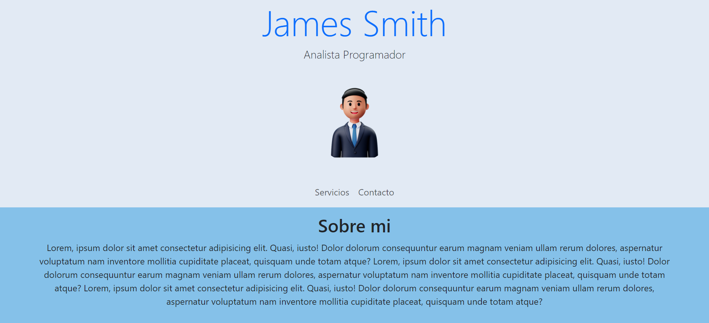
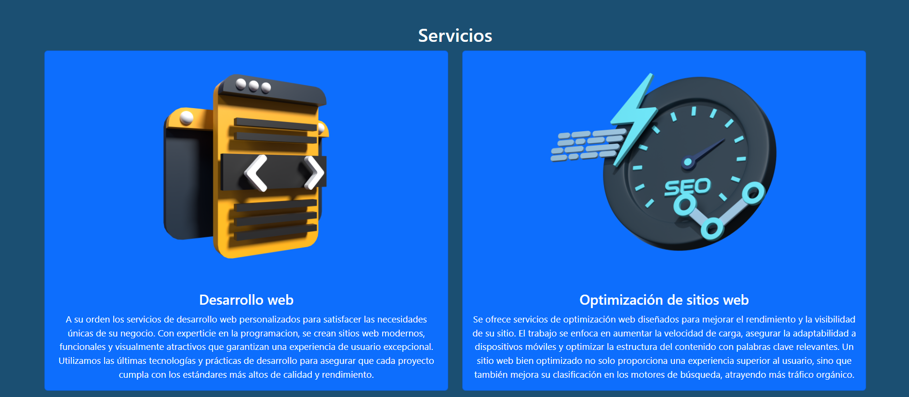

## WebProfile  🌐 
---
💻*WebProfile es un sitio web básico para mostrar los datos profesionales de una persona, sus servicios y datos de contacto.*  

Es proyecto para principiantes en la programacion, ideal para las personas que desean desplegar su propio sitio web para dar a conoser sus servicios.  
[Visitar sitio WebProfile aquí](https://richardc-dev.github.io/webProfile/)

### Caracteristicas tecnicas de WebProfile 🛠
- Lenguaje de marcado: HTML5
- Estilo: CSS3 y Bootstrap 5.3.2

#### Estructura del Proyecto  
```plaintext
WebProfile/
│
├── index.html
├── css/
│   └── estilo.css
├── imagenes/
│   └── iconoFac.png
│   └── iconoLin.png
│   └── imgAvatar.png
│   └── imgSeo.png
│   └── imgWeb.png
│   ├── captures/
│   |   └── cap1.png
└── README.md
```

### Imagenes

1.  Esta es la página principal de la aplicación, donde los usuarios pueden ver el contenido inicial y navegar a otras secciones.  

2.  Esta es la página principal de la aplicación, donde los usuarios pueden ver los servicios profecionales.  

3.  Esta es la página principal de la aplicación, donde los usuarios pueden ver los datos de contacto y los links de redes sociales.  


